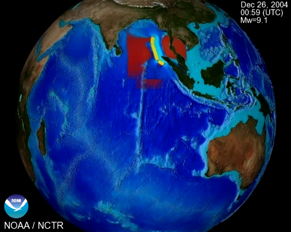
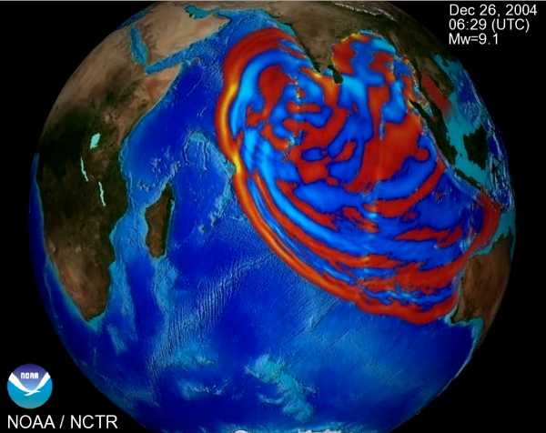

1. Calculus and Linear Algebra for Data Science--What is it about?
    + Calculus is one the two great modeling technologies. The other is probability and statistics. In theory and practice, both depend on linear algebra.
    + If you flip a coin in the air, calculus can tell you its ultimate height and the time it will remain in the air. Probability can tell you the chance of its landing on heads.
    + In their modern forms, both calculus and probability arose in 17$^{th}$ Century Europe, calculus in connection with planetary motion, probability in connection with games of chance. (It was always more down to Earth.) 
    + Computers have revolutionized application of both. Linear algebra has been essential to that revolution.
2. Who is this course for?
    + It's a primer, conceived as a bridge between DSS and advanced topics in linear models and machine learning.
    + Should provide sufficient introduction or refresher in calculus and linear algebra for an understanding of ordinary least squares modeling and principal component analysis.
    + Emphasis is computational, not symbolic. Concepts, yes, but programs will do the work. It is no substitute for a traditional course, but may serve to complement one.
3. What are its prerequisites? 
    + Familiarity with the R programming language and basic algebra. 
    + At very least, basic building blocks, vectors and matrices in R Programming.
    + Will suggest others lesson by lesson.
4. Why is it interesting?
    + On December 26, 2004, at approximately 7 AM local time, an undersea earthquake of magnitude 9.0 occurred off the west coast of Sumatra, Indonesia.
    + 
    + Five hours later, 237,000 people had been killed by the deadliest tsunami ever recorded.
    +  
    + The disaster prompted a large investment in tsunami detection and forecasting. If a similar event occurred today, a tsunami warning system would predict innundation long before the waves arrived. 
    + Tsunami forecasts are based on a deterministic model of wave propagation expressed in "differential equations" of calculus. (The figure is based on such a simulation.)
    + [Link to animated Tsunami simulation](http://en.wikipedia.org/wiki/Shallow_water_equations#mediaviewer/File:Tsunami_with_Boussinesq_and_Shallow_water_equations.gif)
# Too complicated. Use the 1D shallow water approximations instead * Navier-Stokes equations$$\nabla \cdot \mathbf{u} = 0 $$ $$ \rho \left( \frac{\partial \mathbf{u}}{\partial t} + \mathbf{u} \cdot \nabla \mathbf{u}\right) = -\nabla p + \mu \nabla^2 \mathbf{u} + \mathbf{g}$$
#    + In these equations, the terms in bold are vectors. The deltas and nablas (triangles) indicate differentials.
    ```{r fig.show='hold', fig.align='center'}
    plot(0:1, 0:1, type='n', xlab="", ylab="", xaxt="n", yaxt="n", bty="n", main="Tsunami Equations", cex.main=2)
text(.5, .7, expression(over(partialdiff*h, partialdiff*t)== -over(partialdiff*v, partialdiff*x)), pos=4, cex=2)
text(.5, .3, expression(over(partialdiff*v, partialdiff*t) == -g*h*over(partialdiff*h, partialdiff*x)), pos=4, cex=2)
```
    + "Differentials" refer to instantaneous rates of change in time or slopes in space.
    + To model the progress of a wave, the differentials must be added up, or "integrated" in time and space.
    + Integrating these equations takes a great deal of computation, and many tricks must be used to make forecasts timely and accurate. A decent system is in place. Research is ongoing.
    + [Reference 1](http://en.wikipedia.org/wiki/2004_Indian_Ocean_earthquake_and_tsunami) 
    + [Reference 2](http://nctr.pmel.noaa.gov/tsunami-forecast.html)
    + [Movie](http://nctr.pmel.noaa.gov/animations/sumatraGlobe.mpg)
